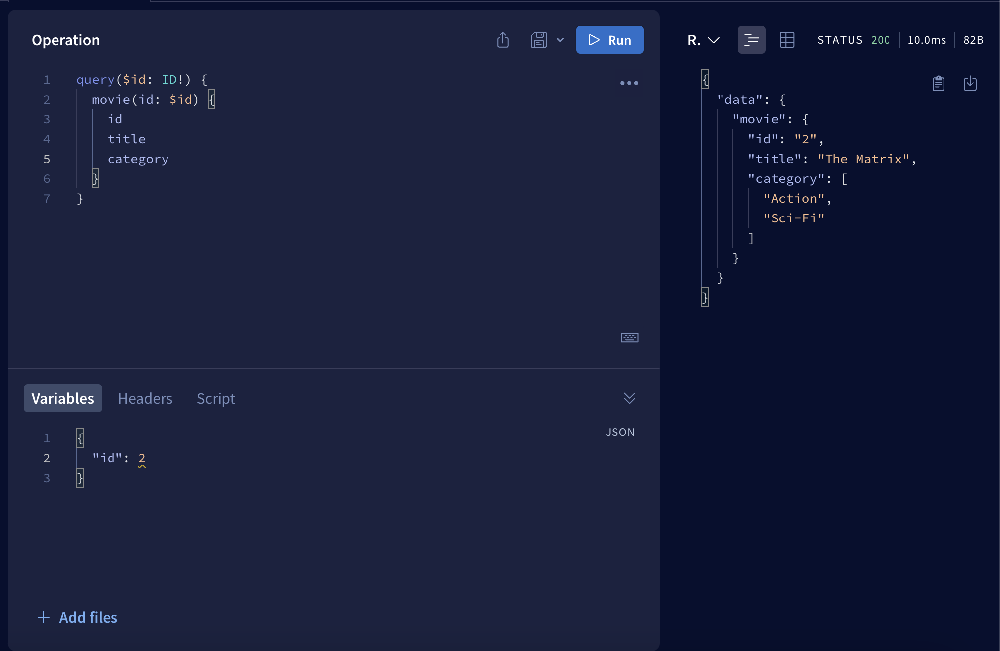
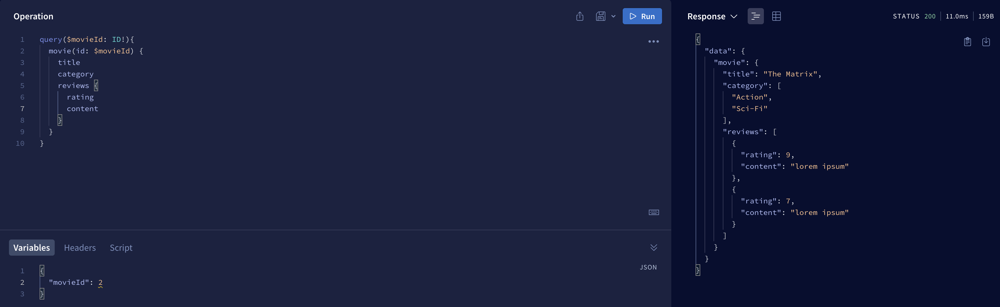
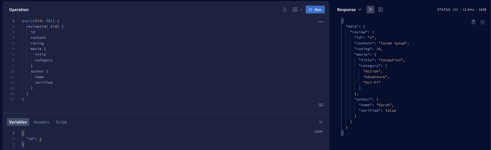
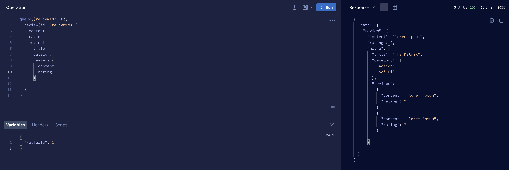
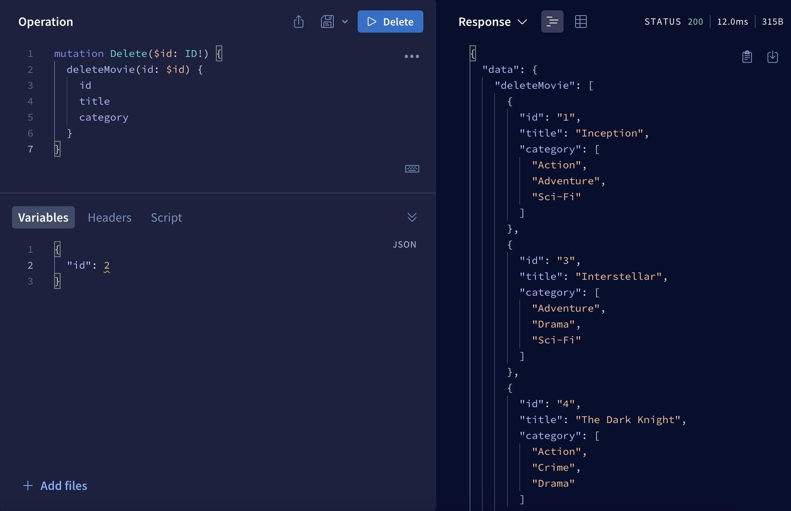
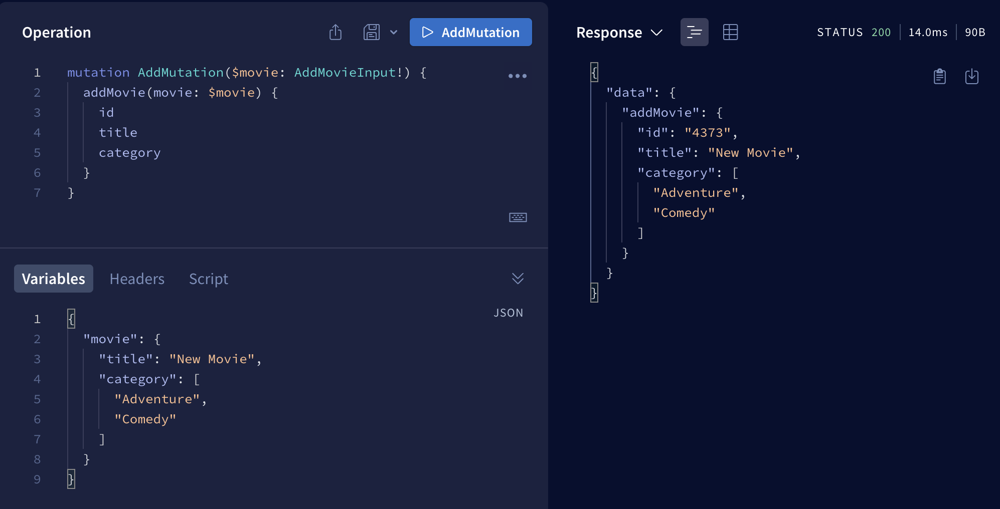
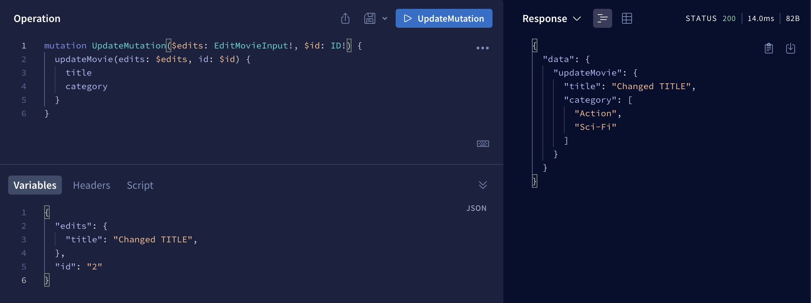

# Basics of GraphQL
## What is GraphQL?

GraphQL is an open-source query language for API, and a server-side runtime for executing those queries by specifying the shape of the response data. It was developed by Facebook in 2012 and released as an open-source project in 2015. In 2018 the GraphQL Schema Definition Language (SDL) became part of the specification. GraphQL provides a more efficient, powerful, and flexible alternative to the traditional REST API architecture for fetching and manipulating data from a server.

## Key features
- Graph**QL** is a **Q**uery **L**anguage,
- Alternative to REST API,
- Still uses HTTP requests under the hood, 
- We specify what resource and what properies we want to get back, 
- Fetch nested related data within a single query

## Differences between REST API and GraphQL
|        REST API         |      GraphQL      |
|:-----------------------:|:-----------------:|
| Uses multiple endpoints | Uses one endpoint |

## Problems that graphql solves
- Over fetching - getting back more data than we need (unnecessary load and sending excess information),
- Under fetching - getting back less data than we need (this requires making e.g. several requests).


## Prerequisites
Before you begin, make sure you have basic knowledge about the following topics:
- NodeJS
- TypeScript

## Apollo Server
Apollo Server is an open-source GraphQL server implementation that allows you to build and run GraphQL APIs. You can run Apollo Server in various programming languages, including JavaScript (Node.js), Python, and more.

## Create a new project
First of all, we need to create a folder for our server.
```shell
mkdir GraphQLArticle
cd GraphQLArticle
```
Then we need to init new project with npm and set type property to allow us to using ES6 modules.
```shell
npm init --yes && npm pkg set type="module"
```

## Install dependencies
Applications that run Apollo Server require two dependencies:
- `graphql` - the library that implements the core GraphQL parsing and execution algorithms,
- `@apollo/server` - the main library for Apollo Server itself.

To install this dependencies we need to execute this command:
```shell
npm install @apollo/server graphql
```

As we can see in `package.json` file, dependencies have been installed and `type` property is set to `module`.
```json
{
  "type": "module",
  "dependencies": {
    "@apollo/server": "^4.9.5",
    "graphql": "^16.8.1"
  }
}
```

Now we need to define if we want to use JavaSript or TypeScript. We will use **TypeScript**.

First let's create a `src` directory with an empty `index.ts` file to contain all of the code for our example application:
```shell
mkdir src
touch src/index.ts
```

Run the following command to install the `typescript` and `@types/node` packages into your project's dev dependencies:
```shell
npm install --save-dev typescript @types/node
```

Next, create a `tsconfig.json` file in your project:
```shell
touch tsconfig.json
```

The `tsconfig.json` file enables you to configure how TypeScript will compile your code. Add the following configuration to your `tsconfig.json` file:
```json
{
  "compilerOptions": {
    "rootDirs": ["src"],
    "outDir": "dist",
    "lib": ["es2022"],
    "target": "es2022",
    "module": "esnext",
    "moduleResolution": "node",
    "esModuleInterop": true,
    "types": ["node"]
  }
}
```

Finally, replace the default scripts entry in your `package.json` file with the following:
```json
{
  "scripts": {
    "compile": "tsc",
    "start": "npm run compile && node ./dist/index.js"
  }
}
```

The above start script tells TypeScript to compile your code into JavaScript before using node to run that compiled code.

Final `package.json` file should look like this:
```json
{
  "name": "graphqlarticle",
  "version": "1.0.0",
  "description": "",
  "main": "index.js",
  "scripts": {
    "compile": "tsc",
    "start": "npm run compile && node ./dist/index.js"
  },
  "keywords": [],
  "author": "",
  "license": "ISC",
  "type": "module",
  "dependencies": {
    "@apollo/server": "^4.9.5",
    "graphql": "^16.8.1"
  },
  "devDependencies": {
    "@types/node": "^20.10.0",
    "typescript": "^5.3.2"
  }
}

```

You can now run `npm start`, which should successfully compile and run your empty `index.ts` file.

## Setting up Apollo Server

First, we need to make some imports to be able to create Apollo Server and define the port.
```typescript
import { ApolloServer } from "@apollo/server";
import { startStandaloneServer } from "@apollo/server/standalone";
const PORT = 4000;
```

After that, we have to set up our server.
```typescript
const server = new ApolloServer({
    //typeDefs
    //resolvers
});

const { url } = await startStandaloneServer(server, {
    listen: {
        port: PORT
    }
});

console.log(`Server is listening on port ${PORT}`);
```

First we're creating server itself and then we're starting it on our local machine on the particular port (in our case 4000).

And that's a basic setup of the server, later we'll create `typeDefs` and `resolvers` functions to be able to make a requests to our server.

All the start code base is available on branch `initial` under this link: [GitHub repo](https://github.com/Michal-Turbanski/GraphQLArticle/tree/initial)

## Type definitions

**Type definitions** in GraphQL are core aspect of defining the structure and shape of data that can be queried and manipulated through a GraphQL API. They define what kinds of objects can be requested and what fields they have.

GraphQL has a few scalar types which we'll be using most of the time: 
- `String` - text data,
- `Int` - 32-bit integer,
- `Float` - signed double-precision floating-point value, 
- `Boolean` - true or false value,
- `ID` - special type used to represent unique identifiers. ID type is serialized in the same way as a String; however, defining it as ID signifies that it is unique within the GraphQL system.

Let's create file `schema.ts` where we'll be storing all schema objects. We're creating three schemas that will be representing `movie`, `review` and `author`.

```graphql
export const typeDefs = `#graphql
    type Movie {
        id: ID!
        title: String!
        category: [String!]!
    }
    
    type Review {
        id: ID!
        rating: Int!
        content: String!
    }
    
    type Author {
        id: ID!
        name: String!
        verified: Boolean!
    }
    
    type Query {
        movies: [Movie]
        reviews: [Review]
        authors: [Author]
    }
`;
```

Part `#graphql` at the beginning of template string helps IDE with syntax highlighting.

Exclamation mark (`!`) after type means that the field is required (cannot be null).

When we're creating array of string like in this field `category: [String!]!` we force both the array and the elements inside it to be required.

At the end we have a `Query` type. It's a special type in GraphQL that defines the entry points for the data that clients can read from the API. It means for example, if we call `movies` we'll get array of `Movie` objects. 

Now we can import this type defs to `index.ts` file and pass it to `ApolloServer` constructor. 

```typescript
const server = new ApolloServer({
    typeDefs
    //resolvers
});
```

## Resolver functions
Resolver functions are components that connect the GraphQL schema to the data sources. They are responsible for fetching or computing the data that's requested by a client's query or mutation. 

Now let's create a database. We'll create a file with sets of array. Complete database is available [here](https://github.com/Michal-Turbanski/GraphQLArticle/blob/main/src/_db.ts). 

Create a file `resolvers.ts` and inside it we'll define resolver functions:

```typescript
import db from './_db.js';

export const resolvers = {
    Query: {
        movies() {
            return db.movies;
        },

        reviews() {
            return db.reviews;
        },

        authors() {
            return db.authors;
        },
    }
}
```

First we import our file DB. Next we're creating `resolvers` constant with `Query` property. And inside it we're creating functions which return specific arrays from the database. Notice that function names must match the names defined in the `Query` type in `type defs`. 

One last thing to do is to add `resolvers` constant to Apollo constructor as a second argument in `index.ts` file. 

```typescript
const server = new ApolloServer({
    typeDefs,
    resolvers,
});
```

And that's it. Now we are able to make a request to our server. Let's run our server with `npm start` command. If everything goes well go to `localhost:4000` in your browser and you should see Apollo Explorer UI.


Now let's create our first request - assume we want to get only movies and their categories. 


As you can see we defined our resource - in this example it was `movies` and inside it we defined all properites we want to get - in this case `title` and `category`. 

Now try making different requests with `reviews` and `authors` and try fetching different fields.

## Query variables

Okay, but what if we want to get only one movie? Or one review? For this purpose we will use **Query Variables**.

First we have to extend our entry points by adding possibility to fetch for example one review.

```graphql
movies: [Movie]
movie(id: ID!): Movie
```

As you can see we added `id` as a query varable (it's requered) and as a result we expect one movie. 

Now try to add query variables to `reviews` and `authors` resources. 

After that we have to update resolver functions by adding new functions with the same names as in the schema where we return one particular eg. movie. 

```typescript
movie(_, args) {
    return db.movies.find(movie => movie.id === args.id);
},
```

We added `movie` function (singular form). Let's skip for now first argument, as a second argument we have to add arguments. And we're returning one movie with given `id`. 

And that's it. Try to add resolver functions for `review` and `author`. 

Now let's run the server and check if we can access one movie. 



As you can see we can fetch one particular movie. We added id to our `query` and next we passed it to movie function. In the `Variables` section below we defined (as a JSON object) what `id` we want to get. 

Try to fetch one review and author as well to train this new feature. 

## Nested data
Now we can move to the most powerful and sophisticated feature in GraphQL which is relationships between our data. 

As you can see in our database we have `author_id` and `movie_id` for each review. 

```typescript
{ id: '1', rating: 9, content: 'lorem ipsum', author_id: '1', movie_id: '2' }
```
So every review has associated author and every review has associated movie. 
And we use this relation for nesting data.

So as always we'll start with updating our schema. If every review has author and ralated movie, we'll add it to the schema (both movie and author is required because every review must have an author and the film being reviewed).

```graphql
type Review {
    id: ID!
    rating: Int!
    content: String!
    movie: Movie!
    author: Author!
}
```

Next every movie can have multiple reviews, so we need to add array of reviews for `Movie` schema.

```graphql
reviews: [Review!]
```

Please note, that we only added exclamation mark inside the brackets, because every object in this array has to be the review. But we can't add exclamation mark after end bracket because **the movie may not have any reviews and we have to take that into account too!**

And we can add the same line of code to `Author` schema because like the movie, author also can has multiple reviews. And that's enough for the schema, let's jump to the resolver functions to handle this case. 

So our first case will be to fetch one movie and all reviews related to it. From a frontend side we want to make this kind of request.

```graphql
query($movieId: ID!) {
  movie(id: $movieId) {
    title
    category
    reviews {
      rating
      content
    }
  }
}
```

For now our server doesn't know how to handle it. And if we try to make this request we get `null` in `reviews` object. 

We have to add new entry in `resolver` function, but not in `Query` object (because it's not an entry point for our graph), but next to it, as a second property like this.

```typescript
export const resolvers = {
    Query: {
        ...
    },
    Movie...
}
```

It should look like this

```typescript
Movie: {
    reviews(parent) {
        return db.reviews.filter(review => review.movie_id === parent.id);
    }
}
```

Now we can go back to previous Query variables topic when we skip first argument in our resolver function. Now it will be necessary. It's a `parent` object which refers to the parent object. In our example it is a `Movie`. Thanks to it we can filter out all the reviews with given `movie_id`. And `parent.id` is really `movie.id`.

Let's try it and go to Apollo explorer and get movie with `id = 2` and all reviews related to it. 



Now try yourself to get:
- Specific author and reviews related to him,
- Specific review and its author,
- specific review and associated movie.

You can find solution [here](https://github.com/Michal-Turbanski/GraphQLArticle/blob/main/src/resolvers.ts).

If you do it properly you should be able to make request like this, when we fetch a specific review with information about related movie and author. 



At this point we unconsciously created a **resolver chain**. This means we can now get into objects endlessly. We can now, for example, retrieve a specific review. Next get information about the movie related to this review. We can finally get all the reviews about this movie. This is all thanks to the fact that we have retained the resolver chain.



## Mutations
Mutation is a type of operation used to modify data on the server. Unlike queries, which are used to fetch data, **mutations are used to create, update, or delete data**.


### Delete mutation
As always we'll start with our schema and we add new `type Mutation` and `deleteMovie` function where we delete particular movie and return rest of the movies.

```graphql
type Mutation {
    deleteMovie(id: ID!): [Movie]
}
```

Now we need to add resolver function where we'll be working with database.

```typescript
Mutation: {
    deleteMovie(_, args) {
        db.movies = db.movies.filter(movie => movie.id !== args.id);
        return db.movies;
    }
}
```

Now how do we actually do the mutation on the frontend side? For now we're using `query` keyword for all the request where we're fetching data. 

For delete, update and create we are using `mutation` keyword. 

```graphql
mutation Delete($id: ID!) {
    deleteMovie(id: $id) {
        id
        title
        category
    }
}
```



Remember, we want to get back rest of the movies so we need to specify what fields we want to get back. And if you run it, you'll get back all the movies except this with `id = 2`. Now we're using hardcoded database so when you restart your server you'll have all the movies.

### Create mutation

Now let's make create mutation. To do that we'll create `addMovie` mutation and as an argument we'll use new `input` type `AddMovieInput`. As a response we'll use created movie. 

```graphql
type Mutation {
    addMovie(movie: AddMovieInput): Movie
    deleteMovie(id: ID!): [Movie]
}

input AddMovieInput {
    title: String!
    category: [String!]!
}
```

Now let's make resolver function to it.

```typescript
addMovie(_, args){
    let movie = {
        ...args.movie,
        id: Math.floor(Math.random() * 10000).toString()
    }
    db.movies.push(movie);
    return movie;
}
```

As you can see we created a new movie from given arguments. Then we generated an ID. Next we'll push new movie to DB and return this movie. You can see results below. 



Now please check if movie was created (using `query` keyword). 

### Update mutation

As always we'll start with schema and we'll create `updateMovie` mutation.

```graphql
updateMovie(id: ID!, edits: EditMovieInput!): Movie
```

And for this purpose we created new `EditMovieInput` input. 

```graphql
input EditMovieInput {
    title: String
    category: [String!]
}
```

We did this because:
- We don't want to allow modify the ID,
- We make both `title` and `category` array optional, because we don't know what fields user would like to change.

If we did this, we can move on to resolver function. 

```typescript
updateMovie(_, args) {
    db.movies = db.movies.map(movie => {
        if (movie.id === args.id) {
            return { ...movie, ...args.edits };
        }
        return movie;
    });
    return db.movies.find(movie => movie.id === args.id);
}
```

In this function we edit movie with particular id, and we can specify if we want to chage only one field or many fields. As a response we return movie with given id. 



As you can see everything is working as expected. We change movie with `id = 2` and we change only the title. 

## Summary
In this article, I wanted to discuss the basics of working with graphQL and show that it can be an interesting alternative to REST API. I really hope you enjoyed and you hopefully feel comfortable now with the basics of this technology. Thanks!