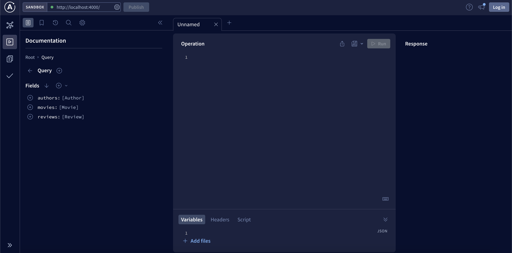
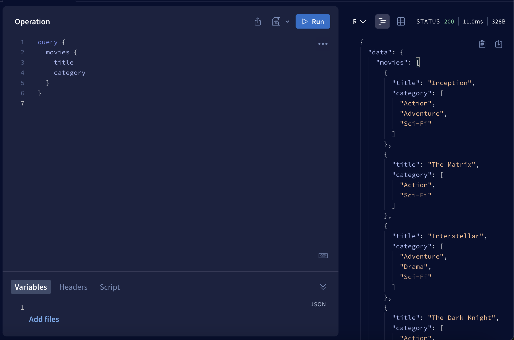

# Basics of GraphQL
## What is GraphQL?

GraphQL is an open-source query language for API, and a server-side runtime for executing those queries by specifying the shape of the response data. It was developed by Facebook in 2012 and released as an open-source project in 2015. In 2018 the GraphQL Schema Definition Language (SDL) became part of the specification. GraphQL provides a more efficient, powerful, and flexible alternative to the traditional REST API architecture for fetching and manipulating data from a server.

## Key features
- Graph**QL** is a **Q**uery **L**anguage,
- Alternative to REST API,
- Still uses HTTP requests under the hood, 
- We specify what resource and what properies we want to get back, 
- Fetch nested related data within a single query

## Differences between REST API and GraphQL
|        REST API         |      GraphQL      |
|:-----------------------:|:-----------------:|
| Uses multiple endpoints | Uses one endpoint |

## Problems that graphql solves
- Over fetching - getting back more data than we need (unnecessary load and sending excess information),
- Under fetching - getting back less data than we need (this requires making e.g. several requests).


## Prerequisites
Before you begin, make sure you have basic knowledge about the following topics:
- NodeJS
- TypeScript

## Apollo Server
Apollo Server is an open-source GraphQL server implementation that allows you to build and run GraphQL APIs. You can run Apollo Server in various programming languages, including JavaScript (Node.js), Python, and more.

## Create a new project
First of all, we need to create a folder for our server.
```shell
mkdir GraphQLArticle
cd GraphQLArticle
```
Then we need to init new project with npm and set type property to allow us to using ES6 modules.
```shell
npm init --yes && npm pkg set type="module"
```

## Install dependencies
Applications that run Apollo Server require two dependencies:
- `graphql` - the library that implements the core GraphQL parsing and execution algorithms,
- `@apollo/server` - the main library for Apollo Server itself.

To install this dependencies we need to execute this command:
```shell
npm install @apollo/server graphql
```

As we can see in `package.json` file, dependencies have been installed and `type` property is set to `module`.
```json
{
  "type": "module",
  "dependencies": {
    "@apollo/server": "^4.9.5",
    "graphql": "^16.8.1"
  }
}
```

Now we need to define if we want to use JavaSript or TypeScript. We will use **TypeScript**.

First let's create a `src` directory with an empty `index.ts` file to contain all of the code for our example application:
```shell
mkdir src
touch src/index.ts
```

Run the following command to install the `typescript` and `@types/node` packages into your project's dev dependencies:
```shell
npm install --save-dev typescript @types/node
```

Next, create a `tsconfig.json` file in your project:
```shell
touch tsconfig.json
```

The `tsconfig.json` file enables you to configure how TypeScript will compile your code. Add the following configuration to your `tsconfig.json` file:
```json
{
  "compilerOptions": {
    "rootDirs": ["src"],
    "outDir": "dist",
    "lib": ["es2022"],
    "target": "es2022",
    "module": "esnext",
    "moduleResolution": "node",
    "esModuleInterop": true,
    "types": ["node"]
  }
}
```

Finally, replace the default scripts entry in your `package.json` file with the following:
```json
{
  "scripts": {
    "compile": "tsc",
    "start": "npm run compile && node ./dist/index.js"
  }
}
```

The above start script tells TypeScript to compile your code into JavaScript before using node to run that compiled code.

Final `package.json` file should look like this:
```json
{
  "name": "graphqlarticle",
  "version": "1.0.0",
  "description": "",
  "main": "index.js",
  "scripts": {
    "compile": "tsc",
    "start": "npm run compile && node ./dist/index.js"
  },
  "keywords": [],
  "author": "",
  "license": "ISC",
  "type": "module",
  "dependencies": {
    "@apollo/server": "^4.9.5",
    "graphql": "^16.8.1"
  },
  "devDependencies": {
    "@types/node": "^20.10.0",
    "typescript": "^5.3.2"
  }
}

```

You can now run `npm start`, which should successfully compile and run your empty `index.ts` file.

## Setting up Apollo Server

First, we need to make some imports to be able to create Apollo Server and define the port.
```typescript
import { ApolloServer } from "@apollo/server";
import { startStandaloneServer } from "@apollo/server/standalone";
const PORT = 4000;
```

After that, we have to set up our server.
```typescript
const server = new ApolloServer({
    //typeDefs
    //resolvers
});

const { url } = await startStandaloneServer(server, {
    listen: {
        port: PORT
    }
});

console.log(`Server is listening on port ${PORT}`);
```

First we're creating server itself and then we're starting it on our local machine on the particular port (in our case 4000).

And that's a basic setup of the server, later we'll create `typeDefs` and `resolvers` functions to be able to make a requests to our server.

All the start code base is available on branch `initial` under this link: [GitHub repo](https://github.com/Michal-Turbanski/GraphQLArticle/tree/initial)

## Type definitions

**Type definitions** in GraphQL are core aspect of defining the structure and shape of data that can be queried and manipulated through a GraphQL API. They define what kinds of objects can be requested and what fields they have.

GraphQL has a few scalar types which we'll be using most of the time: 
- `String` - text data,
- `Int` - 32-bit integer,
- `Float` - signed double-precision floating-point value, 
- `Boolean` - true or false value,
- `ID` - special type used to represent unique identifiers. ID type is serialized in the same way as a String; however, defining it as ID signifies that it is unique within the GraphQL system.

Let's create file `schema.ts` where we'll be storing all schema objects. We're creating three schemas that will be representing `movie`, `review` and `author`.

```graphql
export const typeDefs = `#graphql
    type Movie {
        id: ID!
        title: String!
        category: [String!]!
    }
    
    type Review {
        id: ID!
        rating: Int!
        content: String!
    }
    
    type Author {
        id: ID!
        name: String!
        verified: Boolean!
    }
    
    type Query {
        movies: [Movie]
        reviews: [Review]
        authors: [Author]
    }
`;
```

Part `#graphql` at the beginning of template string helps IDE with syntax highlighting.

Exclamation mark (`!`) after type means that the field is required (cannot be null).

When we're creating array of string like in this field `category: [String!]!` we force both the array and the elements inside it to be required.

At the end we have a `Query` type. It's a special type in GraphQL that defines the entry points for the data that clients can read from the API. It means for example, if we call `movies` we'll get array of `Movie` objects. 

Now we can import this type defs to `index.ts` file and pass it to `ApolloServer` constructor. 

```typescript
const server = new ApolloServer({
    typeDefs
    //resolvers
});
```

## Resolver functions
Resolver functions are components that connect the GraphQL schema to the data sources. They are responsible for fetching or computing the data that's requested by a client's query or mutation. 

Now let's create a database. We'll create a file with sets of array. Complete database is available [here](https://github.com/Michal-Turbanski/GraphQLArticle/blob/main/src/_db.ts). 

Create a file `resolvers.ts` and inside it we'll define resolver functions:

```typescript
import db from './_db.js';

export const resolvers = {
    Query: {
        movies() {
            return db.movies;
        },

        reviews() {
            return db.reviews;
        },

        authors() {
            return db.authors;
        },
    }
}
```

First we import our file DB. Next we're creating `resolvers` constant with `Query` property. And inside it we're creating functions which return specific arrays from the database. Notice that function names must match the names defined in the `Query` type in `type defs`. 

One last thing to do is to add `resolvers` constant to Apollo constructor as a second argument in `index.ts` file. 

```typescript
const server = new ApolloServer({
    typeDefs,
    resolvers,
});
```

And that's it. Now we are able to make a request to our server. Let's run our server with `npm start` command. If everything goes well go to `localhost:4000` in your browser and you should see Apollo Explorer UI.



Now let's create our first request - assume we want to get only movies and their categories. 



As you can see we defined our resource - in this example it was `movies` and inside it we defined all properites we want to get - in this case `title` and `category`. 

Now try making different requests with `reviews` and `authors` and try fetching different fields.

## Query variables

Okay, but what if we want to get only one movie? Or one review? For this purpose we will use **Query Variables**.
